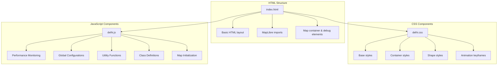

# Delhi Map Implementation Organization Plan

## File Structure



## File Details

### 1. index.html
Minimal structure containing:
- Document head with metadata
- MapLibre CSS/JS imports
- Links to delhi.css and delhi.js
- Essential container divs
- Debug/monitoring elements

### 2. delhi.css
Organized sections with descriptive comments:
```css
/* =====================
   Base Styles
   ===================== */
/* Body, map container basics */

/* =====================
   Container Styles 
   ===================== */
/* Mandala container and positioning */

/* =====================
   Shape Styles
   ===================== */
/* Layer and shape definitions */

/* =====================
   Animation Keyframes
   ===================== */
/* All animation definitions */
```

### 3. delhi.js
Comprehensive organization with instrumentation:

#### Performance Monitoring Section
```javascript
/**
 * Performance Monitoring System
 * Tracks and logs:
 * - Frame rates
 * - Memory usage
 * - Animation performance
 * - Resource utilization
 * - Operation timing
 */
```

#### Global Configurations
```javascript
/**
 * Application Configuration
 * Includes:
 * - Delhi-specific settings
 * - Performance thresholds
 * - Animation parameters
 * - Debug flags
 */
```

#### Utility Functions
```javascript
/**
 * Utility Functions
 * - Logging system
 * - Performance measurements
 * - Debug helpers
 * - Error handling
 */
```

#### Class Definitions
Each class will include:
- JSDoc documentation
- Performance instrumentation
- Error handling
- Debug logging
- Memory management

Example structure:
```javascript
/**
 * @class RoadManager
 * @description Manages road animations with performance monitoring
 * @property {Performance} metrics - Performance tracking
 */
```

#### Map Initialization
```javascript
/**
 * Map Initialization
 * Includes:
 * - Performance bootstrapping
 * - Resource loading
 * - Error handling
 * - Debug mode setup
 */
```

## Performance Monitoring Implementation

### Key Metrics Tracked:
1. Frame Rates
   - Target vs actual FPS
   - Frame time distribution
   - Animation smoothness

2. Memory Usage
   - Heap size monitoring
   - Garbage collection impact
   - Resource allocation

3. Operation Timing
   - Animation updates
   - Render operations
   - Asset loading
   - Event handling

### Instrumentation Methods:
```javascript
// Performance measurement wrapper
const measureOperation = (operationName, operation) => {
    const start = performance.now();
    try {
        return operation();
    } finally {
        const duration = performance.now() - start;
        logPerformance(operationName, duration);
    }
};

// Memory monitoring
const checkMemory = () => {
    if (performance.memory) {
        const used = performance.memory.usedJSHeapSize;
        const limit = performance.memory.jsHeapSizeLimit;
        logMemoryUsage(used, limit);
    }
};
```

## Debug/Development Features

### Logging Levels:
- ERROR: Critical issues
- WARN: Potential problems
- INFO: General operation info
- DEBUG: Detailed debugging
- PERF: Performance metrics

### Debug Tools:
- Visual performance overlay
- Memory usage graphs
- Animation frame timing
- Event logging
- Error tracing

## Implementation Guidelines

1. Error Handling:
   - Comprehensive try-catch blocks
   - Detailed error logging
   - Graceful degradation
   - User feedback

2. Documentation:
   - JSDoc for all classes/methods
   - Inline comments for complex logic
   - Performance considerations
   - Debug instructions

3. Code Organization:
   - Clear separation of concerns
   - Modular performance monitoring
   - Consistent logging patterns
   - Clean debug integration

4. Testing Considerations:
   - Performance benchmarks
   - Memory leak detection
   - Animation smoothness tests
   - Error condition handling

This organization ensures maintainable, well-documented code with comprehensive performance monitoring and debugging capabilities.